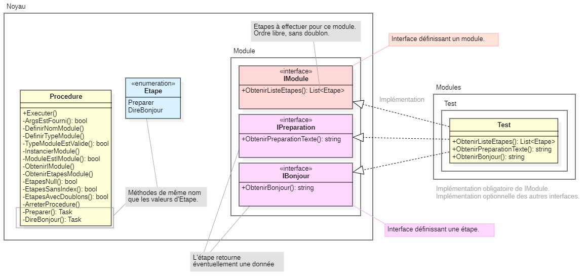
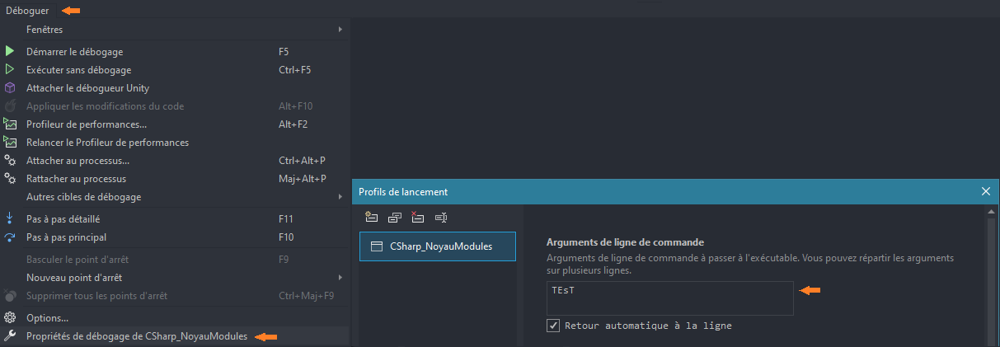

# CSharp_NoyauModules

But : 
- organiser l'application en noyau et modules,
- lancer l'application en lui passant en arguement un nom de module à exécuter, quelle que soit la casse,
- structurer les modules de façon à ce qu'ils fournissent une procédure à exécuter par le programme, procédure dont les étapes sans doublon et leur ordre sont libres et définis au développement,
- une étape dans la procédure est prédéfinie en noyau.

La présente solution est une solution de test pour un programme Console. 

Exemples de mise en œuvre possible : 
- un module lit une information en base de données puis produit un fichier Excel,
- un second module lit la même information mais produit un fichier `.csv` puis envoie un courriel avec ce fichier en pièce jointe,
- un troisième envoie un courriel avec la date du jour dans le corps du message et une formule chaleureuse de salutation, sans aucune pièce jointe.

Diagramme UML de classe (réalisé avec StarUML) :



## Exécuter le programme

Le programme peut être exécuté en **Invite de commande** Windows avec la commande suivante. Se positionner au préalable dans le répertoire.

```
CSharp_NoyauModules TEsT
```

Le programme peut être exécuté dans Visual Studio en *Debug*. Au préalable, depuis le menu `Déboguer > Propriétés de débogage de CSharp_NoyauModules`, ouvrir la fenêtre des **Profils de lancement**, puis renseigner sous **Arguments de ligne de commande** le champ de saisie avec la valeur `TEsT`.



## Fonctionnement 

La classe `Procedure` est la classe principale du programme. Elle teste les entrées, instancie le module, appelle les fonctions d'étapes. 

Ces fonctions d'étapes ont le même nom que les noms d'une enum nommée `Etape`, à des fins d'harmonisation. Par exemple, on trouve une valeur `Etape.TraiterDonnees`, ce qui implique disposer de la la méthode `Procedure.TraiterDonnees()`.

Un module est une classe nommée `Module`, située dans un espace de nom au nom libre mais situé en enfant de `Modules`. La classe implémente obligatoirement l'interface `IModule` pour être reconnue module et fournir la liste des étapes qui forment la procédure qui lui est spécifique. 

La liste des étapes déclarée dans le module doit correspondre aux interfaces que la classe de module implémente s'il existe une interface correspondante. Par exemple, le programme propose la fonctionnalité "dire bonjour", ce qui prend la forme de la valeur d'enum `Etape.DireBonjour`, de la fonction `Procedure.DireBonjour()` et d'une interface `IBonjour` qui permet de fournir le texte représentant le fait de souhaiter un bon jour.

L'ordre des étapes déclaré dans le module a son importance, selon les fonctionnalités de chaque interface. Les méthodes de `Procedure` relatives aux étapes doivent donc aussi gérer les erreurs sur les attendus d'une étape précédente. Par exemple, `Procedure.MultiplierNombre()` (`Etape.MultiplierNombre`, `INombre`) doit tester si un nombre existe bel et bien et qui doit avoir été obtenu auparavant par `Procedure.ObtenirNombre()` (`Etape.ObtenirNombre`, `INombreTraitement`).

La gestion des interfaces, des valeurs d'enum `Etape` et des méthodes est libre. Par exemple, il est possible d'utiliser une seule interface pour plusieurs étapes qui seraient facultatives : avec `IDonnees`, après avoir `Etape.ObtenirDonnees`, peut-être qu'on ne veut pas `Etape.TraiterDonnees` mais plutôt `Etape.AfficherNombreEnregistrements`.

## Notes

L'application utilise des entités de l'espace de nom `System.Reflection`, que ce soit pour déclencher les méthodes de procédures ou pour par exemple explorer un modèle de données fourni par un module mais que `Procedure` ne peut pas connaître.

Pour les projets complexes, on n'hésitera pas à créer autant de classes nécessaires dans le noyau.
